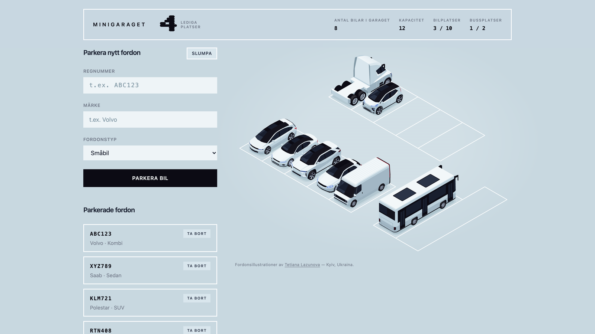

# MiniGarage

**[Live demo →](https://laszloprekop.github.io/fe-09-minigarage/)**

[](https://laszloprekop.github.io/fe-09-minigarage/)

A digital vehicle catalogue: park vehicles into a garage and watch them appear both as a list
and as an isometric plan of the lot.

Built as **Övning 9 — Minigaraget med React**. The application calls itself *Minigaraget* on
screen and its interface is Swedish; the code and documentation are English.

## What it does

- **Park a vehicle** by registration number and make, choosing from twelve vehicle types
- **Swedish plate validation** — `ABC123` or `ABC12A`, with lowercase input coerced to uppercase
- **Real capacity.** Every garage plan has a fixed set of bays in three lengths. A vehicle takes
  the smallest free bay it fits in, so a bus can be turned away even while car bays sit empty
- **A garage per session.** One of five hand-authored plans is picked at random on load
- **Isometric view** of the lot, drawn from the same array that renders the list, with hover
  linking a row to its bay in both directions

## Stack

| | |
|---|---|
| Framework | React 19 + TypeScript |
| Build | Vite |
| Styling | Tailwind CSS v4, with a palette derived from the artwork in OKLCH |
| Tests | Vitest — 77 tests over the pure functions in `src/domain/` |

## Getting started

```bash
npm install
npm run dev      # development server
npm test         # unit tests
npm run build    # production build
npm run preview  # serve the production build under its deploy subpath
```

Every push to `main` builds, runs the tests, and deploys to GitHub Pages
([workflow](.github/workflows/deploy.yml)).

## How it is put together

- **`src/App.tsx`** owns all state. Adding, removing, counting and rendering the list all happen
  here, in one file.
- **`src/domain/`** is pure: plate validation, best-fit bay assignment, the isometric grid
  conversion, and the random vehicle generator. No React, no state, all tested.
- **`src/data/`** holds the vehicle catalogue, the brand table, the garage plans, and the
  generated sprite geometry.
- **`tools/extract-vehicles.mjs`** cuts the 19 vehicle sprites out of a single source artboard
  (`materials/isometric_vehicles/`) and records where each one sits in its bay. It is run by
  hand and its output is committed — the artwork changes about twice a decade.

The domain vocabulary — what a *bay*, a *footprint* and a *plan* mean here — is in
[`CONTEXT.md`](CONTEXT.md).

## Credits

The isometric vehicle illustrations are by **Tetiana Lazunova** of Kyiv, Ukraine —
[vecteezy.com/members/tartila-stock71065](https://www.vecteezy.com/members/tartila-stock71065).

## Q&A

**Are the vehicles separable because they started as a 3D model? And how do they end up in the right place on screen?**

It's not 3D, it's a vector stock illustration:
[various isometric car logistic delivery vehicles](https://www.vecteezy.com/vector-art/46431172-various-isometric-car-logistic-delivery-vehicles-with-cargo-trailer-truck-van-car-and-motorcycle-for-transport-company-set-different-automobiles-for-personal-usage)
by Tetiana Lazunova.

I carefully grouped the vector shapes into "cars", fixed their blending modes, unified their
colour palette, and placed them on an isometric grid in Affinity: 74 px cells, 30° angle.

I also added the bay shapes below the cars, which I could then reuse to calculate the placement
of a car relative to a generated iso-bay — a parking spot.

Then a script exports the cars out of the master SVG, and those individual sprites are used to
rebuild the scene later. The placement order matters, back to front — otherwise cars at the back
float over the cars in front.

The separated car designs live in [`public/vehicles`](public/vehicles), and the splitter script
has to run again whenever the master SVG changes.

The garage view is then reconstructed as an SVG in the page, from plan data objects — the garage
layouts in [`src/data/plans.ts`](src/data/plans.ts).

Placing the sprites is just a loop over a 2D matrix. It is only the illusion of a 3D space; the
paint order fakes the depth.

### Where that lives in the code

| File | Job |
|---|---|
| [`tools/extract-vehicles.mjs`](tools/extract-vehicles.mjs) | splits the master, records each sprite's offset from its bay |
| [`src/data/sprites.generated.ts`](src/data/sprites.generated.ts) | the generated offsets — never edited by hand |
| [`src/domain/iso.ts`](src/domain/iso.ts) | grid units → screen pixels, and the depth order |
| [`src/data/plans.ts`](src/data/plans.ts) | the garage layouts, in whole grid units |
| [`src/domain/parking.ts`](src/domain/parking.ts) | picks which bay a vehicle gets |
| [`src/components/GarageView.tsx`](src/components/GarageView.tsx) | draws the bays, then the vehicles |

The isometric conversion is two constants and two lines:

```ts
export const ISO_X = 74 * Math.cos(Math.PI / 6); // 64.09
export const ISO_Y = 74 * Math.sin(Math.PI / 6); // 37

export function toScreen(along: number, across: number) {
  return { x: (along + across) * ISO_X, y: (across - along) * ISO_Y };
}
```

One step *along* a bay moves right and up, one step *across* moves right and down. That is the
whole trick — no projection matrix anywhere.

The offsets are not guessed either. Every vehicle already sits inside a bay in the master
artwork, so the script measures the gap between the two bounding boxes and writes it down. A
vehicle is then drawn at its bay's position plus that recorded offset, and `dy` comes out
negative for all of them because a vehicle is taller than the ground it stands on.

A car only stores which bay it is in. Everything visible is computed from that.

## Language rule

English for everything a developer reads: identifiers, comments, commits, documentation.
Swedish only for strings the user sees on screen.
